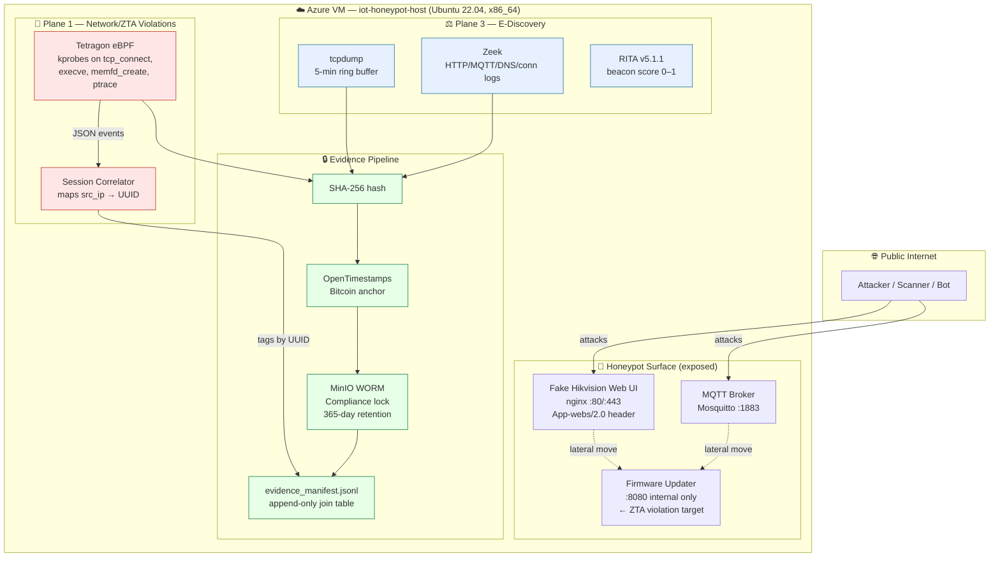
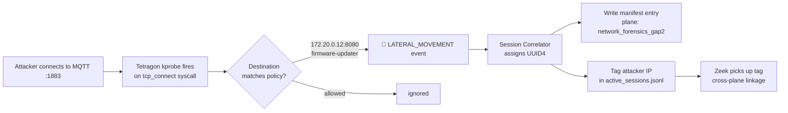
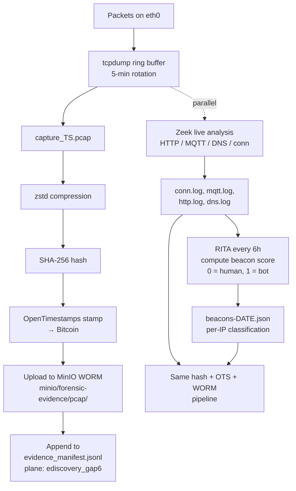

# IoT Zero Trust Architecture Honeypot — Network & E-Discovery Planes

> A reproducible IoT honeypot that captures attacker behavior across two independent forensic planes, links every artifact by a shared session UUID, and seals every piece of evidence with blockchain-anchored chain-of-custody proofs.

This guide covers **Plane 1 (Network / Zero Trust Architecture Violations)** and **Plane 3 (E-Discovery / Chain of Custody)**. It's written so a graduate student, security engineer, or curious reader can stand the whole thing up on a fresh cloud VM and reach a fully working state in roughly four hours.

---

## Table of Contents

1. [What This Project Does (and Why)](#what-this-project-does-and-why)
2. [High-Level Architecture](#high-level-architecture)
3. [Plane 1 — Network / ZTA Violations](#plane-1--network--zta-violations)
4. [Plane 3 — E-Discovery / Chain of Custody](#plane-3--e-discovery--chain-of-custody)
5. [Step-by-Step Recreation Guide](#step-by-step-recreation-guide)
6. [Repository Structure (What Lives Where)](#repository-structure-what-lives-where)
7. [Sample Outputs](#sample-outputs)
8. [Verification Checklist](#verification-checklist)
9. [Troubleshooting](#troubleshooting)
10. [Citation and Credits](#citation-and-credits)

---

## What This Project Does (and Why)

The project pretends to be a **Hikvision DS-2CD2183G2 IP camera** on the public internet. Attackers find it, attack it, and every interaction is captured by three independent observation systems — each viewing the attack from a different angle. The artifacts each system produces are hashed, timestamped on the Bitcoin blockchain via OpenTimestamps, and sealed into a Write-Once-Read-Many (WORM) object store with a 365-day legal retention lock.

**Why this matters**: today's IoT forensics is shallow. You can usually get network logs, but rarely kernel-level activity, and almost never live memory state — and even when you do have them, the chain of custody is too weak to hold up in court or satisfy GDPR/HIPAA auditors. This project demonstrates a complete pipeline that's all three: deep, multi-layer, and legally defensible.

Two of the three planes are documented here:

| Plane | What It Captures | Tools |
|-------|------------------|-------|
| **Plane 1 — Network / ZTA** | Kernel-level evidence of trust boundary violations (lateral movement, fileless staging, process injection) | Tetragon eBPF |
| **Plane 3 — E-Discovery** | Court-admissible network evidence with blockchain proofs | tcpdump + Zeek + RITA + MinIO WORM + OpenTimestamps |

(Plane 2 — Live Memory Forensics with PANDA + Volatility — is documented separately.)

---

## High-Level Architecture



### How the diagram reads

- **Red boxes (Plane 1)** watch the kernel. When an attacker pivots from the MQTT broker to the firmware-updater (a trust-boundary violation), Tetragon sees the `tcp_connect` syscall and logs it with the full process tree.
- **Blue boxes (Plane 3)** watch the wire. Every packet is captured to a rotating PCAP file; Zeek parses protocols; RITA scores each source IP for "how robotic does this look" using beacon analysis.
- **Green boxes (Evidence pipeline)** apply to every artifact, regardless of plane. SHA-256, then a Bitcoin-anchored OpenTimestamps proof, then upload to a WORM bucket that physically refuses deletion or modification for 365 days.

---

## Plane 1 — Network / ZTA Violations

### The forensic question this plane answers

> *"Did an attacker who reached the MQTT broker pivot into a service they shouldn't have touched? And can I prove it with kernel-level evidence?"*

### How it works



### What we detect

Four classes of ZTA violation, defined in [`src/tetragon/policies/zt-forensics.yaml`](src/tetragon/policies/zt-forensics.yaml):

| Trigger | Syscall watched | Why it matters |
|---------|----------------|----------------|
| **Lateral movement** | `tcp_connect` to internal-only ports (e.g. 8080) | Attacker bypassed the trust boundary between the MQTT plane and the firmware plane |
| **Binary drop & execute** | `sys_execve` from `/tmp/`, `/dev/shm/`, `/var/tmp/` | Classic IoT malware staging pattern (Mirai family) |
| **Fileless staging** | `sys_memfd_create` | Malware that never touches disk — invisible to file-system AV |
| **Process injection** | `sys_ptrace` with `PTRACE_POKEDATA` | Attacker injecting code into a victim process |

### Outputs

- **Raw events** → `/forensics/tetragon/tetragon.log` (JSON Lines, one event per line)
- **Correlated entries** → `/forensics/manifest/evidence_manifest.jsonl` with `"plane": "network_forensics_gap2"`
- **Session index** → `/forensics/manifest/active_sessions.jsonl` (so Plane 3 can tag matching packets)

---

## Plane 3 — E-Discovery / Chain of Custody

### The forensic question this plane answers

> *"For every attacker connection, do I have packet-level evidence, protocol-level analysis, behavioral classification, and a tamper-evident proof of when each was captured — strong enough to satisfy a court (FRE 902) or regulator (GDPR Article 32)?"*

### How it works



### What we capture

| Artifact | Captured by | Rotation | Sealed in WORM |
|---------|-------------|----------|----------------|
| `*.pcap.zst` (raw packets) | `pcap_capture.sh` | every 5 min | yes |
| `conn.log`, `mqtt.log`, `http.log`, `dns.log` | Zeek | every 5 min | yes |
| `beacons-YYYYMMDD.json` (per-IP score) | RITA v5.1.1 | every 6 h | yes |
| `*.ots` (Bitcoin proof) | `ots stamp` | one per artifact | yes |
| `evidence_manifest.jsonl` | session correlator | append-only | yes |

### The RITA beacon score, in plain English

RITA looks at every `(source_IP, destination_IP)` pair in Zeek's `conn.log` and asks three questions:

1. Are the connection times evenly spaced? *(A bot calling home every 60 s scores high; a human browsing scores low.)*
2. Are all the connections the same length? *(Bots have predictable session durations; humans don't.)*
3. Are the data sizes consistent? *(Beacons send fixed-size heartbeats; real traffic varies wildly.)*

Each question yields a sub-score 0–1; RITA averages them into a final beacon score. Thresholds:

- **≥ 0.80** → Automated scanner / C2 (very low false-positive rate)
- **0.25 – 0.80** → Ambiguous (jittered bot or noisy human)
- **< 0.25** → Human actor (very low false-negative rate)

The sparse middle of the distribution is what makes the classifier defensible — see [`src/scripts/figures_legaltrace.py`](src/scripts/figures_legaltrace.py) for the histogram code.

### Why each layer is needed for legal admissibility

| FRE 902 requirement | How we satisfy it |
|---------------------|-------------------|
| Authenticity | SHA-256 hash recorded in manifest at capture time |
| Existence at time T | OpenTimestamps proof anchored in Bitcoin block |
| No post-collection tampering | MinIO Compliance Object Lock (365-day retention, deletion physically refused) |
| Chain of custody | Append-only `evidence_manifest.jsonl` linking artifact → hash → OTS proof → MinIO path → session UUID |

---

## Step-by-Step Recreation Guide

> **Time estimate**: ~4 hours start-to-finish on a fresh Azure VM. Most of that is downloads and one kernel build for the ARM ISF (which can run in parallel).

### Prerequisites

- Azure account with `Standard_D4s_v3` quota (4 vCPU, 16 GB RAM, Ubuntu 22.04, x86_64). The Azure for Students free tier covers this for ~$32/week.
- A 128 GiB Premium SSD data disk attached to the VM.
- SSH key for `ubuntu@<vm-ip>`.
- Network Security Group inbound rules: 22 (SSH), 80, 443, 1883.

### Phase 0 — VM provision and disk mount

```bash
# Set hostname and clock
sudo hostnamectl set-hostname iot-honeypot-host
sudo timedatectl set-timezone UTC

# Find your data disk — it's the 128 GiB unpartitioned one
lsblk

# ⚠️ Pin the data disk by UUID, NEVER by /dev/sdX
# Azure can reshuffle device letters on stop/start (we got bitten by this).
DATA_DEV=$(lsblk -bno NAME,SIZE,MOUNTPOINT | awk '$2==137438953472 && $3=="" {print "/dev/"$1; exit}')
sudo mkfs.ext4 "$DATA_DEV"
DATA_UUID=$(sudo blkid -s UUID -o value "$DATA_DEV")

sudo mkdir -p /forensics
echo "UUID=$DATA_UUID /forensics ext4 defaults,nofail 0 2" | sudo tee -a /etc/fstab
sudo mount /forensics
sudo mkdir -p /forensics/{pcap,zeek,rita,evidence,manifest,tetragon,logs}
sudo chown -R ubuntu:ubuntu /forensics
```

### Phase 1 — Install Docker, Zeek, MongoDB, Python deps

```bash
sudo apt-get update
sudo apt-get install -y ca-certificates curl gnupg jq git wget build-essential \
  python3 python3-pip python3-venv tcpdump nmap netcat-openbsd \
  mosquitto-clients zstd

# Docker (from upstream, since docker.io was removed from Ubuntu)
curl -fsSL https://download.docker.com/linux/ubuntu/gpg | \
  sudo gpg --dearmor -o /etc/apt/keyrings/docker.gpg
echo "deb [arch=$(dpkg --print-architecture) signed-by=/etc/apt/keyrings/docker.gpg] \
  https://download.docker.com/linux/ubuntu $(. /etc/os-release; echo "$VERSION_CODENAME") stable" | \
  sudo tee /etc/apt/sources.list.d/docker.list
sudo apt-get update
sudo apt-get install -y docker-ce docker-ce-cli containerd.io docker-compose-plugin
sudo usermod -aG docker $USER && newgrp docker

# Zeek (Plane 3 protocol analysis)
echo 'deb http://download.opensuse.org/repositories/security:/zeek/xUbuntu_22.04/ /' | \
  sudo tee /etc/apt/sources.list.d/security:zeek.list
curl -fsSL https://download.opensuse.org/repositories/security:/zeek/xUbuntu_22.04/Release.key | \
  sudo gpg --dearmor -o /etc/apt/trusted.gpg.d/security_zeek.gpg
sudo apt-get update && sudo apt-get install -y zeek

# MongoDB (RITA backend)
curl -fsSL https://www.mongodb.org/static/pgp/server-7.0.asc | \
  sudo gpg --dearmor -o /usr/share/keyrings/mongodb-server-7.0.gpg
echo "deb [arch=amd64 signed-by=/usr/share/keyrings/mongodb-server-7.0.gpg] \
  https://repo.mongodb.org/apt/ubuntu jammy/mongodb-org/7.0 multiverse" | \
  sudo tee /etc/apt/sources.list.d/mongodb-org-7.0.list
sudo apt-get update && sudo apt-get install -y mongodb-org
sudo systemctl enable --now mongod

# OpenTimestamps client (Bitcoin proof generation)
pip3 install opentimestamps-client paho-mqtt flask requests
```

### Phase 2 — Plane 1 deployment (Tetragon + Session Correlator)

```bash
# Pull and start Tetragon. --export-filename is REQUIRED so the JSON log file
# is written; without it our paper figure scripts read an empty file.
docker run --name tetragon --rm -d --pid=host --cgroupns=host --privileged \
  -v /sys/kernel/btf/vmlinux:/var/lib/tetragon/btf \
  -v /forensics/tetragon:/var/log/tetragon \
  quay.io/cilium/tetragon:v1.1.2 \
  --export-filename /var/log/tetragon/tetragon.log

# Load the ZTA tracing policy (lateral move + binary drop + memfd + ptrace)
sudo mkdir -p /opt/tetragon/policies
sudo cp src/tetragon/policies/zt-forensics.yaml /opt/tetragon/policies/
docker cp /opt/tetragon/policies/zt-forensics.yaml tetragon:/tmp/
docker exec tetragon tetra tracingpolicy add /tmp/zt-forensics.yaml
docker exec tetragon tetra tracingpolicy list   # STATE must show enabled

# Deploy the session correlator
sudo mkdir -p /opt/correlator
sudo cp src/correlator/session_correlator.py /opt/correlator/

# IMPORTANT: log to /tmp because ubuntu user can't write to /var/log
nohup bash -c "docker exec tetragon /usr/bin/tetra getevents --output json \
  --include-fields 'process,parent,function_name,args,time' \
  | python3 /opt/correlator/session_correlator.py" \
  > /tmp/correlator.log 2>&1 &
disown

# Make Tetragon's root-owned logs readable by the ubuntu user that runs the
# uploader. Without this, `mc cp` silently fails on tetragon files.
sudo tee /etc/systemd/system/tetragon-chown.service > /dev/null <<'EOF'
[Unit]
Description=Keep Tetragon logs ubuntu-readable for WORM upload
[Service]
Type=oneshot
ExecStart=/bin/chown -R ubuntu:ubuntu /forensics/tetragon
EOF

sudo tee /etc/systemd/system/tetragon-chown.timer > /dev/null <<'EOF'
[Unit]
Description=Run tetragon-chown every minute
[Timer]
OnBootSec=30s
OnUnitActiveSec=60s
[Install]
WantedBy=timers.target
EOF
sudo systemctl daemon-reload
sudo systemctl enable --now tetragon-chown.timer
```

### Phase 3 — Plane 3 deployment (PCAP + Zeek + RITA + MinIO + OTS)

```bash
# --- PCAP ring buffer (5-min rotation, then process + stamp + upload) ---
sudo mkdir -p /opt/scripts
sudo cp src/scripts/{pcap_capture.sh,pcap_process.sh,zeek_rotate_stamp.sh,rita_analyze.sh,sync_isf.sh} \
  /opt/scripts/
sudo chmod +x /opt/scripts/*.sh

nohup /opt/scripts/pcap_capture.sh &
disown

# --- Zeek (with our IoT plugin config) ---
sudo cp src/zeek/local.zeek /opt/zeek/share/zeek/site/local.zeek
sudo cp src/zeek/zeekctl.cfg /opt/zeek/etc/zeekctl.cfg
sudo /opt/zeek/bin/zeekctl deploy
sudo /opt/zeek/bin/zeekctl start

# --- RITA v5.1.1 (Go 1.22 required; apt golang-go is 1.18 — too old) ---
wget -O /tmp/go.tar.gz https://go.dev/dl/go1.22.5.linux-amd64.tar.gz
sudo tar -C /usr/local -xzf /tmp/go.tar.gz
export PATH=$PATH:/usr/local/go/bin:$HOME/go/bin
echo 'export PATH=$PATH:/usr/local/go/bin:$HOME/go/bin' >> ~/.bashrc
go install github.com/activecm/rita/v5@v5.1.1
sudo cp src/rita/config.yaml /etc/rita/config.yaml

(crontab -l 2>/dev/null; echo "0 */6 * * * /opt/scripts/rita_analyze.sh") | crontab -

# --- MinIO WORM (Compliance-mode object lock, 365-day retention) ---
wget -O /tmp/minio https://dl.min.io/server/minio/release/linux-amd64/minio
wget -O /tmp/mc    https://dl.min.io/client/mc/release/linux-amd64/mc
sudo mv /tmp/minio /tmp/mc /usr/local/bin/ && sudo chmod +x /usr/local/bin/{minio,mc}

# Generate a strong admin password and create the systemd service
openssl rand -hex 32 | sudo tee /etc/minio-password >/dev/null
sudo chmod 600 /etc/minio-password

sudo tee /etc/systemd/system/minio.service > /dev/null <<'EOF'
[Unit]
Description=MinIO WORM Storage
After=network.target
[Service]
User=ubuntu
Group=ubuntu
ExecStart=/bin/bash -c 'MINIO_ROOT_USER=forensic-admin MINIO_ROOT_PASSWORD=$(cat /etc/minio-password) \
  /usr/local/bin/minio server /forensics/evidence \
  --console-address 127.0.0.1:9001 --address 127.0.0.1:9002'
Restart=always
[Install]
WantedBy=multi-user.target
EOF
sudo systemctl daemon-reload && sudo systemctl enable --now minio

# Wait 3 s for MinIO to listen, then create the WORM bucket
sleep 3
mc alias set minio http://127.0.0.1:9002 forensic-admin "$(cat /etc/minio-password)"
mc mb --with-lock minio/forensic-evidence
mc retention set --default COMPLIANCE "365d" minio/forensic-evidence

# Verify the lock is active
mc stat minio/forensic-evidence | grep -iE "lock|retention"
# Expected: Object lock: Enabled, RetentionMode: COMPLIANCE, 365DAYS
```

### Phase 4 — Honeypot surface (the bait)

```bash
# Bring up the fake Hikvision camera stack
sudo mkdir -p /opt/honeypot
sudo cp -r src/honeypot/* /opt/honeypot/
cd /opt/honeypot
docker compose up -d
docker ps --format "{{.Names}}: {{.Status}}"
# Expected: mqtt-broker, web-ui, firmware-updater, behavior-sim all "Up"
```

### Phase 5 — Fingerprint check (mandatory before going live)

```bash
# These three checks must pass before exposing the VM to the internet.
# If any fail, an attacker (or Shodan) will see "honeypot" instead of "camera".
PUBLIC_IP=$(curl -s ifconfig.me)
nmap -sV --version-all "$PUBLIC_IP"        # port 80: App-webs/2.0 (NOT nginx)
curl -sI "http://$PUBLIC_IP/"              # Server: App-webs/2.0
mosquitto_sub -h "$PUBLIC_IP" -t '#' -C 1 -v
```

### Phase 6 — Done

Your honeypot is live. Internet scanners will find it within ~30 minutes (Shodan/Censys/ZMap sweep continuously). Real attacker traffic typically lands within a few hours. No need to advertise the IP anywhere — organic traffic is the experimental design.

---

## Repository Structure (What Lives Where)

```
.
├── README.md                                # this file
├── CLAUDE.md                                # AI assistant operating instructions
│
├── src/
│   ├── tetragon/
│   │   └── policies/zt-forensics.yaml       # Plane 1 — ZTA violation policy
│   │
│   ├── correlator/
│   │   └── session_correlator.py            # Plane 1 ↔ 3 — UUID linkage engine
│   │
│   ├── scripts/
│   │   ├── pcap_capture.sh                  # Plane 3 — PCAP ring buffer
│   │   ├── pcap_process.sh                  # Plane 3 — hash + stamp + upload
│   │   ├── zeek_rotate_stamp.sh             # Plane 3 — same, for Zeek logs
│   │   ├── rita_analyze.sh                  # Plane 3 — 6-hour RITA analysis
│   │   ├── sync_isf.sh                      # (Plane 2 helper, optional)
│   │   ├── figures_zerotrace.py             # Plane 1 paper figures
│   │   └── figures_legaltrace.py            # Plane 3 paper figures
│   │
│   ├── zeek/
│   │   ├── local.zeek                       # Plane 3 — Zeek IoT plugin config
│   │   └── zeekctl.cfg                      # Plane 3 — 5-min rotation, /forensics/zeek
│   │
│   ├── rita/config.yaml                     # Plane 3 — RITA v5.1.1 config
│   │
│   └── honeypot/
│       ├── docker-compose.yml               # Bait — IoT microservices stack
│       ├── mosquitto.conf                   # Bait — MQTT broker
│       ├── nginx-iot.conf                   # Bait — Hikvision fingerprint
│       ├── iot_behavior_sim.py              # Bait — Gaussian MQTT telemetry
│       ├── firmware_server.py               # Bait — ZTA violation target
│       └── html/index.html                  # Bait — fake camera web UI
│
├── docs/
│   ├── ARCHITECTURE.md                      # full 3-plane architecture
│   ├── NETWORKING.md                        # port / firewall reference
│   ├── SECURITY.md                          # threat model and chain-of-custody
│   ├── OPERATIONS.md                        # day-to-day operational runbook
│   ├── TESTING.md                           # validation procedures
│   └── HANDOFF.md                           # how to resume after a break
│
├── papers/                                  # (LaTeX drafts — optional)
│   ├── zerotrace/                           # Plane 1 → DFRWS
│   └── legaltrace/                          # Plane 3 → IEEE TIFS
│
└── .github/workflows/
    └── build-iot-isf.yml                    # CI — ARM kernel symbol generation
```

### Minimum files to copy into a fresh repo

If you want the smallest possible repo that still recreates everything in this guide:

```
src/tetragon/policies/zt-forensics.yaml
src/correlator/session_correlator.py
src/scripts/pcap_capture.sh
src/scripts/pcap_process.sh
src/scripts/zeek_rotate_stamp.sh
src/scripts/rita_analyze.sh
src/zeek/local.zeek
src/zeek/zeekctl.cfg
src/rita/config.yaml
src/honeypot/docker-compose.yml
src/honeypot/mosquitto.conf
src/honeypot/nginx-iot.conf
src/honeypot/iot_behavior_sim.py
src/honeypot/firmware_server.py
src/honeypot/html/index.html
README.md
```

That's 16 files. Everything else (memory plane, paper figures, ML/AI components) is additive.

---

## Sample Outputs

### Plane 1 — Tetragon event (one line of `/forensics/tetragon/tetragon.log`)

```json
{
  "process_kprobe": {
    "process": {
      "exec_id": "aWFkLWhvbmV5cG90LWhvc3Q6OTQ1MzU4MDAwMDAwMDox",
      "pid": 9421,
      "uid": 0,
      "binary": "/usr/bin/curl",
      "arguments": "-X POST http://172.20.0.12:8080/upload"
    },
    "parent": { "binary": "/bin/sh", "pid": 9420 },
    "function_name": "tcp_connect",
    "args": [
      { "sock_arg": { "daddr": "172.20.0.12", "dport": 8080 } }
    ],
    "time": "2026-05-17T03:14:22.401Z"
  }
}
```

> **Reading this**: a curl process spawned from `/bin/sh` connected to 172.20.0.12:8080 — that's the firmware-updater. The MQTT plane should never originate traffic to that port. This is a lateral_movement event.

*Place your real captured Plane 1 sample here:* `<!-- TODO: paste sample tetragon event -->`

---

### Plane 3 — RITA beacon score histogram (LegalTrace figure 1)

After 7 days of organic traffic, the bimodal distribution looks like this:

```
RITA Beacon Score Distribution — 552 unique source IPs
 400 ┤                                              ▆▆▆▆
 350 ┤                                              ████
 300 ┤                                              ████
 250 ┤                                              ████
 200 ┤                                              ████
 150 ┤                                              ████
 100 ┤                                              ████
  50 ┤██                ▂▂                         ████
   0 └┬────┬────┬────┬────┬────┬────┬────┬────┬────┬────┬
     0   0.1  0.2  0.3  0.4  0.5  0.6  0.7  0.8  0.9  1.0

     Human Actor (<0.25):     67 IPs   (red zone)
     Ambiguous (0.25–0.80):  101 IPs   (orange zone)
     Automated Scanner (>0.80): 384 IPs (green zone)
```

> **Reading this**: ~70% of source IPs were clearly automated scanners (expected for an internet-exposed IoT device). The empty middle is the important part — it means the classifier isn't being wishy-washy; the two populations are genuinely separated.

*Place the real PDF here:* `<!-- TODO: embed src/scripts output → fig1_beacon_score_histogram.pdf -->`

---

### Plane 3 — Evidence manifest entry (one line of `/forensics/manifest/evidence_manifest.jsonl`)

```json
{
  "file":          "capture_20260517T031500Z.pcap.zst",
  "sha256":        "a3f8d2e1c9b7...",
  "ots_proof":     "capture_20260517T031500Z.pcap.zst.ots",
  "minio_path":    "minio/forensic-evidence/pcap/capture_20260517T031500Z.pcap.zst",
  "timestamp_utc": "2026-05-17T03:20:11Z",
  "layer":         "raw_pcap",
  "plane":         "ediscovery_gap6",
  "session_id":    "7f3a4e91-d8e1-4c6b-9a52-1f8e3d5b7c20"
}
```

> **Reading this**: at 03:20 UTC on 2026-05-17, capture file with this SHA-256 was timestamped on Bitcoin (the `.ots` proof) and uploaded to MinIO's WORM bucket. It belongs to attacker session `7f3a4e91…`, whose kernel-level activity (Plane 1) and memory activity (Plane 2) can be retrieved by querying the same UUID.

*Place a real captured manifest line here:* `<!-- TODO: paste from /forensics/manifest/evidence_manifest.jsonl -->`

---

### `ots verify` output (proof that an artifact existed on Bitcoin at a specific block)

```
$ ots verify /forensics/pcap/capture_20260517T031500Z.pcap.zst.ots
Success! Bitcoin block 920451 attests existence as of 2026-05-17 04:48:00 UTC
```

> **Reading this**: this artifact's SHA-256 is permanently anchored in Bitcoin block 920451. Anyone with access to the Bitcoin blockchain can independently verify the file existed — exactly as it is now — at or before 04:48 UTC. Even the project authors cannot post-date or alter this proof.

---

## Verification Checklist

Run all of these. Every one must return the expected result before the system is production-grade.

| # | Check | Command | Expected |
|---|-------|---------|----------|
| 1 | Tetragon policy loaded | `docker exec tetragon tetra tracingpolicy list` | `STATE=enabled` |
| 2 | Correlator running | `pgrep -af session_correlator` | 1+ PID |
| 3 | PCAP capture writing | `ls -lh /forensics/pcap/ \| tail -3` | files modified <5 min ago |
| 4 | Zeek running | `sudo /opt/zeek/bin/zeekctl status` | `running` |
| 5 | RITA can analyze | `rita --version && mongosh --eval "db.adminCommand('ping')"` | both ok |
| 6 | MinIO WORM lock active | `mc stat minio/forensic-evidence \| grep -i compliance` | `RetentionMode: COMPLIANCE` |
| 7 | WORM delete refused | `mc cp /etc/hostname minio/forensic-evidence/test.txt && mc rm minio/forensic-evidence/test.txt` | `rm` must error: `Object is WORM protected` |
| 8 | Manifest is valid JSONL | `python3 -c "import json; [json.loads(l) for l in open('/forensics/manifest/evidence_manifest.jsonl')]"` | no error |
| 9 | OTS proofs exist | `find /forensics -name "*.ots" \| wc -l` | > 0 |
| 10 | OTS proof verifies | `ots verify $(find /forensics -name "*.ots" \| head -1)` | `Success!` or `Pending` (wait 1 h and retry) |
| 11 | Honeypot fingerprint correct | `curl -sI http://YOUR_IP/ \| grep Server` | `Server: App-webs/2.0` |
| 12 | Cross-plane linkage works | `jq -r '.session_id' /forensics/manifest/evidence_manifest.jsonl \| sort -u \| wc -l` | matches `wc -l` of `/forensics/manifest/active_sessions.jsonl` |

---

## Troubleshooting

### "Bucket `forensic-evidence` does not exist"

- Run `df -h /forensics` — if it reports `/dev/root` instead of your data disk, the data disk isn't mounted (Azure stop/start can reshuffle `/dev/sd*` names). **Always pin `/forensics` by UUID in `/etc/fstab`**, never `/dev/sdX`.
- If the disk is mounted but the bucket is missing, re-run the `mc mb --with-lock` step from Phase 3.

### MinIO bucket is empty even though scripts say "uploaded"

- This is a silent-failure pattern. Three usual causes:
  1. **Tetragon log files are root-owned** and the `ubuntu` user running `mc cp` can't read them. The `tetragon-chown.timer` in Phase 2 fixes this.
  2. **Async `mc cp ... &` swallows stderr.** Edit the uploader scripts to redirect: `mc cp ... 2>>/forensics/logs/mc-upload-errors.log &`.
  3. **`mc` alias missing for the script's user.** Check `~/.mc/config.json` under the user the script runs as.

### `ots verify` prints "Could not connect to Bitcoin node"

- Benign. The client tries a local `bitcoind` first (trustless), then falls back to public calendar servers. No `bitcoind` on this VM by design. The verification proceeds via the calendar — look for the `Success!` or `Pending` line further down.

### Zeek isn't writing to `/forensics/zeek/`

- `sudo zeekctl` resets `$PATH`. Use the absolute binary: `sudo /opt/zeek/bin/zeekctl deploy`.

### Tetragon JSON log file stays empty

- You forgot `--export-filename /var/log/tetragon/tetragon.log` on the `docker run`. Tetragon defaults to streaming over gRPC only; the file isn't written without that flag.

---

## Citation and Credits

If you build on this work, please cite the project repository and any of the three papers it backs:

- **ZeroTrace** — Network/ZTA Violation Detection in IoT Honeypots → DFRWS
- **SemBridge** — Semantic Bridging of Hardware Events and OS State in IoT Memory Forensics → USENIX Security
- **LegalTrace** — Blockchain-Anchored Chain-of-Custody for IoT Forensic Evidence → IEEE TIFS

Built on:
- [Tetragon](https://github.com/cilium/tetragon) (Cilium Project) — eBPF-based runtime security
- [Zeek](https://zeek.org/) — network security monitor
- [RITA](https://github.com/activecm/rita) (Active Countermeasures) — beacon analysis
- [MinIO](https://min.io/) — S3-compatible object storage with Compliance lock
- [OpenTimestamps](https://opentimestamps.org/) — Bitcoin-anchored timestamping

---

*Last updated: 2026-05-17*
